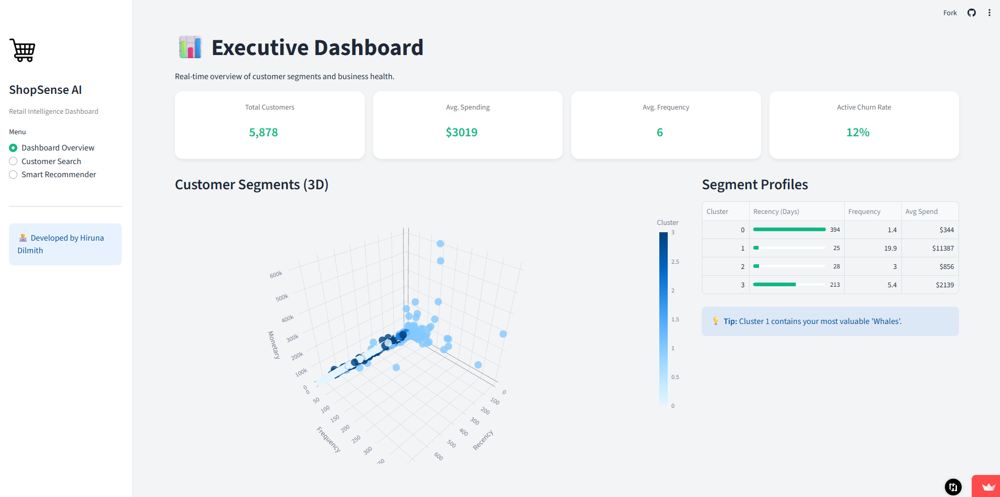
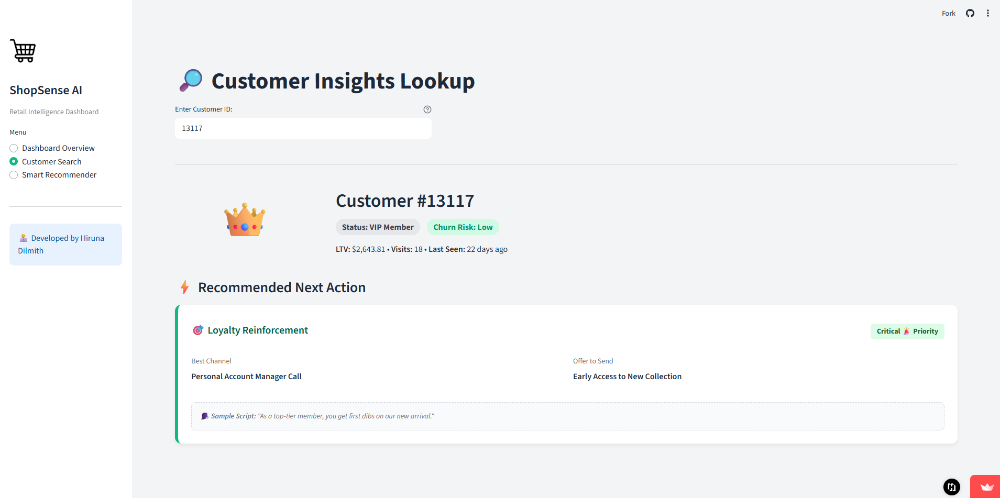

# 🛒 ShopSense AI: Retail Intelligence Dashboard


> **Turning raw transaction data into actionable marketing strategies.** > An End-to-End AI solution that segments customers and recommends products to boost retention and sales.

---

## 📺 Live Demo
[](https://www.youtube.com/watch?v=YOUR_VIDEO_ID)

*(Click the image to watch the 1-minute walkthrough)*

---

## 🧐 The Problem
Small e-commerce businesses often struggle to understand their customers. They treat every buyer the same, missing out on:
* Identifying **VIP customers** who drive the most revenue.
* Re-engaging **Churned users** before they leave forever.
* Suggesting the right **Cross-sell products** to increase basket size.

## 💡 The Solution: ShopSense AI
I built a full-stack data app that processes transaction logs to provide real-time intelligence:
1.  **Customer Segmentation:** Uses **K-Means Clustering** to group users based on Buying Behavior (RFM).
2.  **Churn Risk Analysis:** Automatically flags customers who haven't visited in 90+ days.
3.  **Smart Recommendations:** Uses **Association Rule Mining (Apriori)** to suggest products frequently bought together.
4.  **Actionable Dashboard:** A clean UI that tells the marketing team *exactly* what message to send.

---

## 📸 Screenshots

### 1. Executive Dashboard (Clustering Visualization)


### 2. Customer Insights & AI Strategy


---

## ⚙️ How It Works (The Architecture)

The project follows a professional Data Science pipeline:

### Phase 1: Data Engineering
* **Cleaning:** Removed cancelled orders, handled null values, and filtered for positive quantity transactions.
* **RFM Calculation:** Transformed raw logs into **Recency, Frequency, and Monetary** metrics for each customer.

### Phase 2: Unsupervised Learning (Clustering)
* **Algorithm:** K-Means Clustering (`sklearn`).
* **Optimization:** Used the **Elbow Method** to determine `K=4` optimal segments.
* **The Segments:**
    * 👑 **VIPs:** High spend, frequent visits.
    * 🛒 **Loyal:** Regular buyers, medium spend.
    * 🌱 **New:** Recently joined, low frequency.
    * 😴 **Lost:** High recency (haven't seen in months).

### Phase 3: Recommendation Engine
* **Algorithm:** FP-Growth / Apriori (`mlxtend`).
* **Logic:** "If a user buys *Product A*, they are 45% likely to buy *Product B*."
* **Metric:** Optimized for **Lift** to ensure recommendations are statistically significant, not just popular items.

---

## 🛠️ Tech Stack

* **Language:** Python
* **Machine Learning:** Scikit-Learn, Mlxtend
* **Data Processing:** Pandas, NumPy
* **Visualization:** Plotly Express (3D Interactive Plots)
* **Web Framework:** Streamlit (Custom CSS for Modern UI)

---

## 🚀 How to Run Locally

Want to test the strategy engine? Follow these steps:

1.  **Clone the Repository**
    ```bash
    git clone [https://github.com/yourusername/ShopSense-AI.git](https://github.com/yourusername/ShopSense-AI.git)
    cd ShopSense-AI
    ```

2.  **Install Dependencies**
    ```bash
    pip install -r requirements.txt
    ```

3.  **Run the App**
    ```bash
    streamlit run app.py
    ```

4.  **Access the Dashboard**
    Open your browser at `http://localhost:8501`.

---

## 📂 Project Structure

```text
ShopSense-AI/
├── app.py                   # Main Streamlit Application
├── rfm_analyzed.csv         # Pre-processed Customer Data (Phase 3 Output)
├── association_rules.csv    # Product Rules (Phase 4 Output)
├── requirements.txt         # Project Dependencies
├── .streamlit/
│   └── config.toml          # Theme Configuration
└── README.md                # You are here!
